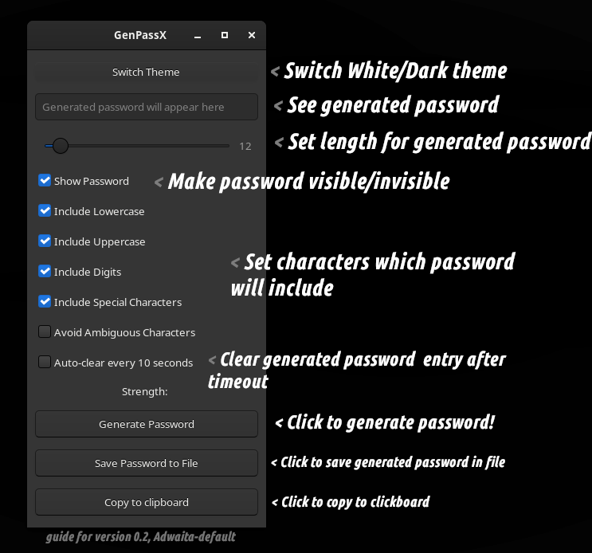

<p align="center">
  
</p>

<p align="center">
  
</p>

# ***GenPassX***

Improved version of our famous **password generation** app! In ***GenPassX*** we added GUI, and also it offers multiple customization options and features.

## Installation

### Prerequisites
Make sure GTK3 is installed on your system. If not, you can install it with the following command:
```bash
sudo apt-get install libgtk-3-dev
```

### Compilation
After installing the required libraries, compile the app using:

```bash
gcc -o genpassx main.c `pkg-config --cflags --libs gtk+-3.0`
```

Running the Application
Once compiled, run the application with:
```bash

```

## Features + Guide
- Generate random passwords of customizable length.
- **Password Strength Indicator:** Displays the strength of the generated password (Weak, Medium, Strong) based on its length and character diversity.
- **Customizable Character Sets:** Choose which character types (lowercase, uppercase, digits, special characters) to include in the password.
- **Password Visibility Toggle:** Easily show or hide the generated password.
- **Save Password:** Save the generated password to a text file.

<p align="center">
  
</p>

<p align="center">
  
</p>

## Usage Tips
- **Avoid Confusing Characters:** In your password, consider replacing ambiguous characters like '0' (zero) with 'O' (letter) to avoid confusion (e.g., LEM0N vs. LEMON).
- **Password Length:** Try to use at least 12 characters for strong passwords.
- **Avoid Real Words:** Ensure your password does not contain any recognizable words for better security.

## To-Do
Below is a list of potential features that can be added in future versions of the app:

- [X] **Password Strength Indicator:** Displays an indicator for the strength of the password.
- [X] **Allow Custom Character Sets:** Lets users choose which character sets to include.
- [X] **Copy to Clipboard:** Adds a button to copy the password to the clipboard.
- [X] **Save Password to a File:** Allows saving the generated password to a text file.
- [X] **Password Expiry Timer:** Clears the password after a set amount of time.
- [ ] **Generate Multiple Passwords:**
Allows generating multiple passwords at once.
- [X] **Password Visibility Toggle:** Adds a toggle button to show or hide the password.
- [ ] **Password History:** Keeps track of previously generated passwords.
- [ ] **Length Slider:** Adds a slider to select the password length.
- [ ] **Advanced Security Options:** Offers options like avoiding ambiguous characters.
- [X] **Dark Mode / Theme Switching:** Adds a dark mode option for the interface.
- [ ] **Password Policy Checker:** Allows defining custom password policies.
- [ ] **Responsive UI for Different Devices:** Ensures the UI is responsive on different screen sizes.
- [ ] **Password Strengthening Algorithms (e.g., Bcrypt, PBKDF2):** Adds strong hashing algorithms for password storage.

## License

This project is licenced under the MIT.
